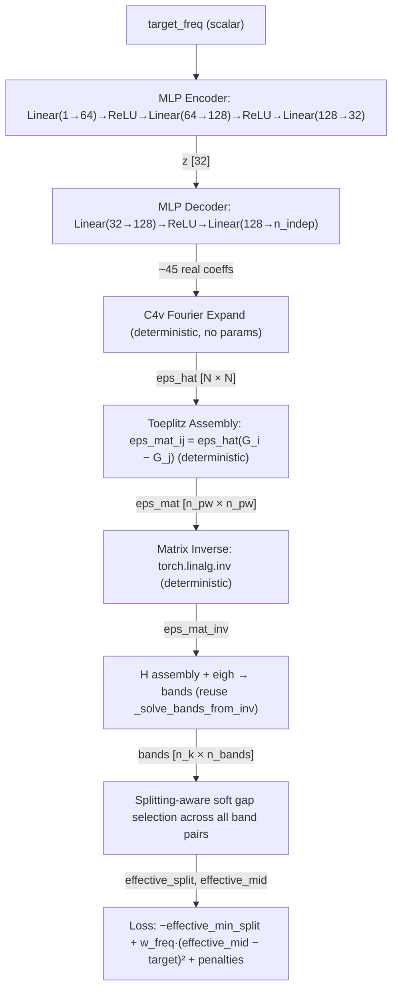

# PWE Band Structure Solver

Plane Wave Expansion solver for 2D photonic crystals on a square lattice. Computes TM and TE band structures with a Tkinter GUI.

## Theory

### Maxwell's equations in periodic media

In a source-free, non-magnetic medium with spatially periodic dielectric function eps(r), Maxwell's equations combine into the master equation for the magnetic field:

$$\nabla \times \left(\frac{1}{\varepsilon(\mathbf{r})} \nabla \times \mathbf{H}\right) = \frac{\omega^2}{c^2} \mathbf{H}$$

By Bloch's theorem, the solutions are labeled by a wavevector **k** in the first Brillouin zone. For each **k**, there is a discrete set of eigenfrequencies omega_n(**k**) -- these are the photonic bands.

### 2D simplification

For a 2D photonic crystal (periodic in xy, uniform in z) with in-plane propagation (k_z = 0), the vector problem decouples into two scalar polarizations:

**TM (E-polarization):** E_z is the only nonzero E component. The wave equation is:

$$-\nabla^2 E_z = \frac{\omega^2}{c^2}\varepsilon(\mathbf{r})E_z$$

**TE (H-polarization):** H_z is the only nonzero H component. The wave equation is:

$$-\nabla \cdot \left(\frac{1}{\varepsilon(\mathbf{r})}\nabla H_z\right) = \frac{\omega^2}{c^2}H_z$$

### Plane wave expansion

Expand the field in plane waves of the reciprocal lattice. For a square lattice with constant a, the reciprocal lattice vectors are **G** = 2*pi*(m1, m2)/a. Truncating to |m1|, |m2| <= n_max gives N_pw = (2*n_max + 1)^2 basis functions.

Substituting the Bloch expansion into the wave equations and projecting onto each plane wave gives matrix eigenvalue problems.

**TM:** The Fourier-space equation is:

$$|\mathbf{k}+\mathbf{G}|^2e_\mathbf{G} = \frac{\omega^2}{c^2} \sum_{\mathbf{G}'} \hat{\varepsilon}(\mathbf{G}-\mathbf{G}')e_{\mathbf{G}'}$$

This is a generalized eigenvalue problem Theta * e = lambda * eps_mat * e, where Theta is diagonal with entries |k+G|^2 and eps_mat is the Toeplitz matrix of Fourier coefficients. To use a standard Hermitian eigensolver, substitute f = Theta^{1/2} e:

$$\Theta^{1/2}\boldsymbol{\varepsilon}^{-1}\Theta^{1/2}\mathbf{f} = \frac{\omega^2}{c^2}\mathbf{f}$$

Element-wise: `H_TM[i,j] = |k+G_i| * eps_mat_inv[i,j] * |k+G_j|`.

**TE:** The Fourier-space equation is:

$$\sum_{\mathbf{G}'} (\mathbf{k}+\mathbf{G})\cdot(\mathbf{k}+\mathbf{G}')\eta(\mathbf{G},\mathbf{G}')h_{\mathbf{G}'} = \frac{\omega^2}{c^2}h_\mathbf{G}$$

where eta represents the 1/eps coupling. This is already Hermitian: `H_TE[i,j] = (k+G_i).(k+G_j) * eps_mat_inv[i,j]`.

### The inverse rule

The eta matrix (representing 1/eps in Fourier space) can be computed two ways:

1. **Direct:** Fourier transform 1/eps(r) to get eta_hat(G-G').
2. **Inverse rule:** Build the epsilon matrix from Fourier coefficients of eps(r), then matrix-invert it: eps_mat^{-1}.

Option 2 converges much faster at sharp dielectric interfaces (Ho, Chan & Soukoulis 1990; Li 1996). This solver uses the inverse rule for both polarizations.

### Brillouin zone path

The irreducible Brillouin zone for a square lattice is the triangle Gamma-X-M. Band extrema (and therefore bandgap edges) occur at high-symmetry points, so sweeping k along Gamma(0,0) -> X(pi/a,0) -> M(pi/a,pi/a) -> Gamma(0,0) captures the full band structure.

### Normalized units

All quantities are in dimensionless units with a = 1, c = 1. Frequencies are reported as omega*a/(2*pi*c), which is equivalent to a/lambda. Bandgap quality is measured by the gap-midgap ratio: Delta_omega / omega_mid.

## Implementation

### Steps

1. **Discretize eps(r)** on an NxN grid over the unit cell.
2. **FFT** the grid to get Fourier coefficients eps_hat(G).
3. **Build the epsilon matrix** `eps_mat[i,j] = eps_hat(G_i - G_j)` -- a Toeplitz matrix of Fourier coefficients, truncated to `(2*n_max+1)^2` plane waves.
4. **Invert** the epsilon matrix (the "inverse rule" gives much better convergence at dielectric interfaces than directly Fourier-transforming 1/eps).
5. **Assemble the Hermitian eigenproblem** at each k-point:
  - **TM** (E_z): `H[i,j] = |k+G_i| * eps_mat_inv[i,j] * |k+G_j|`
  - **TE** (H_z): `H[i,j] = (k+G_i).(k+G_j) * eps_mat_inv[i,j]`
6. **Diagonalize** with `numpy.linalg.eigh`. Eigenvalues are (omega/c)^2; normalized frequencies are `sqrt(eig) / (2*pi)`.
7. **Sweep k** along Gamma -> X -> M -> Gamma to trace out the band structure.

### Parameters


| Parameter  | Description                                                       |
| ---------- | ----------------------------------------------------------------- |
| `r/a`      | Rod radius as fraction of lattice constant                        |
| `eps rod`  | Dielectric constant of rod                                        |
| `eps bg`   | Dielectric constant of background                                 |
| `Grid N`   | Real-space grid resolution (NxN)                                  |
| `PW n_max` | Plane wave cutoff; gives (2*n_max+1)^2 PWs. Keep 2*n_max < Grid N |
| `Bands`    | Number of lowest bands to compute                                 |
| `k/seg`    | k-points per high-symmetry segment                                |


## Usage

```
conda activate iqh
python run.py
```

Adjust parameters in the left panel and click Solve. The GUI shows the dielectric pattern, TM bands, TE bands, and lists any bandgaps with gap/midgap ratios.

### Validation

Default parameters (r/a=0.2, eps=8.9 rods in air) reproduce the classic square-lattice TM bandgap between bands 1-2 (expected gap/midgap ~ 0.31).

## Code structure

### `pwe.py` -- solver library

- `reciprocal_lattice(n_max)` -- generates G vectors `(2*pi*m1, 2*pi*m2)` for all `|m1|, |m2| <= n_max`. Returns both the physical G vectors and integer index pairs, which are used for FFT lookups.
- `build_epsilon_matrix(eps_grid, m_indices)` -- takes the NxN real-space dielectric grid, computes `fft2 / N^2` to get normalized Fourier coefficients, then builds the (n_pw x n_pw) matrix where element `[i,j]` is `eps_fft[(m1_i - m1_j) % N, (m2_i - m2_j) % N]`. The modular indexing maps negative frequency differences to the correct FFT bin.
- `solve_tm(k, g_vectors, eps_mat_inv, n_bands)` -- at a single k-point, computes `|k+G|` for each plane wave, forms the Hermitian matrix `|k+G_i| * eps_mat_inv[i,j] * |k+G_j|`, symmetrizes to kill numerical asymmetry, diagonalizes with `eigh`, clips negative eigenvalues, and returns `sqrt(eig) / 2*pi` as normalized frequencies.
- `solve_te(k, ...)` -- same flow but the matrix is `(k+G_i).(k+G_j) * eps_mat_inv[i,j]` (dot product instead of norm product).
- `solve_bands(k_points, ...)` -- builds the epsilon matrix once, inverts it once, then loops over k-points calling the per-k solver. This is the main entry point.
- `make_k_path(n_per_segment)` -- constructs the Gamma(0,0) -> X(pi,0) -> M(pi,pi) -> Gamma(0,0) path. Points per segment are proportional to segment length. Returns k-points, cumulative distances (for x-axis plotting), and tick positions/labels.

### `run.py` -- GUI application

- `make_rod_epsilon(N, r_over_a, eps_rod, eps_bg)` -- fills an NxN grid: cell centers at `(i+0.5)/N`, marks points within radius `r_over_a` of center (0.5, 0.5) as rod material.
- `find_bandgaps(bands, n_bands)` -- scans consecutive band pairs, reports any where `min(band_{n+1}) > max(band_n)`.
- `PWEApp` -- Tkinter GUI class. Left panel has parameter entries with a live PW count label that updates as you type `n_max`. Clicking Solve spawns a background thread that runs `solve_bands` for both TM and TE, then posts results back to the main thread to update three matplotlib subplots (dielectric map, TM bands, TE bands) and a text box listing detected bandgaps.

## Physics-Informed Neural Network (PINN)

### Overview

`pinn.py` and `pwe_torch.py` add a physics-informed neural network for inverse design of photonic band gaps. Rather than a black-box surrogate, the NN is constrained so its outputs obey the underlying Maxwell equations by construction. The PINN is also accessible from the GUI via the "Train PINN" button.

There are two operating modes:

- **Mode A (inverse design):** The network generates an epsilon grid from a target gap specification, trained end-to-end through a differentiable PWE eigensolve. No pre-computed training data is needed -- gradients flow directly from the physics loss through the solver into the network weights.
- **Mode B (fast surrogate):** The network predicts band frequencies from an epsilon grid, trained against PWE ground truth with additional physics-based loss terms.

### Hard constraints (architectural)

These are enforced by the network structure itself -- they cannot be violated regardless of weight values.


| Constraint                      | Physical law                                                | How it is enforced                                                                                                                                                                                                                 |
| ------------------------------- | ----------------------------------------------------------- | ---------------------------------------------------------------------------------------------------------------------------------------------------------------------------------------------------------------------------------- |
| **C4v crystal symmetry**        | Square lattice has 4-fold rotational + mirror symmetry      | Network outputs only one octant (upper triangle of one quadrant); `c4v_tile` mirrors and rotates it to fill the full NxN grid. The result is symmetric by construction.                                                            |
| **Positive permittivity**       | eps(r) > 0 everywhere for passive dielectrics               | Sigmoid activation on the decoder output maps values to (0, 1), which is then linearly mapped to (eps_bg, eps_rod). Both bounds are positive.                                                                                      |
| **Reciprocity / time-reversal** | omega(k) = omega(-k) for lossless media                     | In Mode B, wavevector k enters the network only through even functions: (kx^2, ky^2, kx*ky). This makes the output invariant under k -> -k by construction. In Mode A this is automatically satisfied by the Hermitian eigensolve. |
| **Non-negative frequencies**    | omega^2 are eigenvalues of a positive-semidefinite operator | In Mode A, inherited from `torch.linalg.eigh` on a Hermitian matrix with eigenvalue clamping. In Mode B, the output uses `softplus` (always >= 0).                                                                                 |
| **Band ordering**               | omega_1 <= omega_2 <= ... <= omega_n                        | In Mode B, the network predicts non-negative increments (via `softplus`), then `cumsum` produces monotonically ordered frequencies. In Mode A, `eigh` returns sorted eigenvalues.                                                  |


### Soft constraints (loss terms)

These are penalty terms in the loss function that push the solution toward physical correctness but can be partially violated during training.


| Loss term                      | Weight flag       | Purpose                                                                                                                                                                                                                        |
| ------------------------------ | ----------------- | ------------------------------------------------------------------------------------------------------------------------------------------------------------------------------------------------------------------------------ |
| **Gap width MSE**              | `--w-gap`         | (target_width - actual_width)^2. Drives the gap toward the desired width.                                                                                                                                                      |
| **Midgap frequency MSE**       | `--w-freq`        | (target_freq - actual_midgap)^2. Centers the gap at the desired frequency.                                                                                                                                                     |
| **Binary penalty**             | `--w-binary`      | mean(s * (1 - s)) where s is the normalized epsilon in [0, 1]. Pushes the design toward binary (air or solid) rather than intermediate values, which is needed for fabricability. Ramped from 10% to full value over training. |
| **Bloch periodicity**          | `--w-bloch`       | MSE between opposite edges of the unit cell. Penalizes designs with boundary discontinuities. (C4v tiling already helps, but this catches residual mismatch.)                                                                  |
| **Eigenvalue residual**        | `--w-residual`    |                                                                                                                                                                                                                                |
| **Variational bound** (Mode B) | `--w-variational` | Penalizes predicted frequencies that fall below the PWE ground truth, since the Rayleigh quotient provides an upper bound.                                                                                                     |
| **Reciprocity check** (Mode B) | `--w-reciprocity` | MSE between omega(k) and omega(-k) predictions. Redundant with the even-function encoding but adds robustness.                                                                                                                 |


### Numerical stability

Three guards prevent NaN during training:

1. **Safe sqrt:** `torch.sqrt(clamp(x, min=1e-12))` avoids infinite gradients at the Gamma point where eigenvalues are exactly zero.
2. **Eigenvalue jitter:** A small diagonal perturbation (1e-12 * I) is added to the Hamiltonian before `eigh` to break exact degeneracies, which cause the backward pass to produce NaN (the gradient involves 1/(lambda_i - lambda_j)).
3. **Clamped softmax:** The smooth min/max functions clamp beta*x to [-80, 80] before `exp` to prevent overflow.

If NaN is still detected in gradients, that training step is skipped and the model weights are not updated.

### Adjustable parameters

#### From the GUI (PINN Inverse Design section)


| Parameter    | Default | Description                                                                                                                                              |
| ------------ | ------- | -------------------------------------------------------------------------------------------------------------------------------------------------------- |
| Objective    | Target  | **Target**: minimise `(gap - target)^2 + (midgap - target)^2`. **Maximize gap**: maximise the gap-midgap ratio `gap/midgap` (target freq/width ignored). |
| target freq  | 0.35    | Desired midgap frequency (a/lambda). Disabled in maximize mode.                                                                                          |
| target width | 0.05    | Desired gap width. Disabled in maximize mode.                                                                                                            |
| band lo      | 0       | Lower band index for gap (0-based)                                                                                                                       |
| band hi      | 1       | Upper band index for gap                                                                                                                                 |
| steps        | 200     | Training iterations                                                                                                                                      |
| lr           | 0.001   | Adam learning rate                                                                                                                                       |
| latent dim   | 32      | Dimensionality of the encoder's latent space                                                                                                             |
| w gap        | 1.0     | Weight for gap width loss                                                                                                                                |
| w freq       | 1.0     | Weight for midgap frequency loss                                                                                                                         |
| w binary     | 0.1     | Weight for binarization penalty                                                                                                                          |
| w bloch      | 0.01    | Weight for Bloch periodicity penalty                                                                                                                     |


The solver parameters (Grid N, PW n_max, Bands, k/seg) and material parameters (eps rod, eps bg) are shared with the PWE solver.

#### CLI-only (pinn.py)


| Flag                   | Default | Description                                                          |
| ---------------------- | ------- | -------------------------------------------------------------------- |
| `--mode`               | inverse | `inverse` (Mode A) or `surrogate` (Mode B)                           |
| `--maximize`           | off     | Flag: maximize gap-midgap ratio instead of targeting specific values |
| `--hidden-dim`         | 256     | Hidden layer width for the surrogate network                         |
| `--n-fourier-features` | 64      | Number of FFT magnitude features for the surrogate encoder           |
| `--w-variational`      | 0.1     | Variational bound penalty weight (Mode B)                            |
| `--w-reciprocity`      | 0.01    | Reciprocity check weight (Mode B)                                    |


### Usage

```
# GUI (includes PINN section)
conda activate iqh
python run.py

# CLI -- inverse design
python pinn.py --mode inverse --steps 300 --target-freq 0.35 --target-width 0.05

# CLI -- surrogate training
python pinn.py --mode surrogate --steps 2000
```

### Code structure

#### `pwe_torch.py` -- differentiable PWE solver

PyTorch port of `pwe.py` with full autograd support. Every operation (FFT, matrix inverse, `eigh`) propagates gradients back to the epsilon grid. Key additions over the NumPy version:

- `_safe_sqrt` -- numerically stable sqrt with clamped input
- Diagonal jitter on the Hamiltonian before `eigh`
- `smooth_min` / `smooth_max` -- differentiable approximations used in the training loss (not for display)
- `extract_gap` -- differentiable gap extraction for the loss function

#### `pinn.py` -- network and training

- `c4v_tile` / `C4vTiler` -- deterministic C4v symmetry expansion from octant to full grid
- `PhysicsLoss` -- combines all soft constraint terms with configurable weights
- `InverseDesignNet` -- MLP encoder + MLP decoder + C4v tiler + sigmoid + linear eps mapping
- `BandSurrogate` -- Fourier feature encoder + even-k encoder + trunk MLP + softplus + cumsum
- `train_inverse` / `train_surrogate` -- training loops with NaN detection, gradient clipping, cosine LR schedule, and binary penalty warmup

## Fourier-Space Inverse Design (`pinn_fourier.py`)

A physics-embedded inverse design network that works in Fourier space. Instead of outputting pixels, the network outputs Fourier coefficients of the dielectric with C4v symmetry, and the Toeplitz matrix assembly is an explicit differentiable layer inside the network. One trained model generalizes across a range of target frequencies.

### Key differences from Mode A (`pinn.py`)


|                       | Mode A (pinn.py)       | Fourier (pinn_fourier.py)                 |
| --------------------- | ---------------------- | ----------------------------------------- |
| Output space          | Pixels (64 values)     | Fourier coefficients (~36-45 real values) |
| Constitutive relation | External FFT           | Toeplitz layer inside network             |
| Training              | Single fixed target    | Multi-target (sampled freq)               |
| Objective             | Match target gap width | Maximize gap width at target freq         |
| Generalization        | One model per target   | One model for any freq in range           |


### Architecture




All solver steps (Toeplitz, inverse, eigh) are inside the autograd graph as deterministic layers -- the constitutive relation is embedded, not external.

### Layer details


| Layer                  | Type                  | Input → Output                         | Trainable?                              |
| ---------------------- | --------------------- | -------------------------------------- | --------------------------------------- |
| **Encoder**            | MLP                   | 1 → 64 → 128 → 32                      | Yes                                     |
| **Decoder**            | MLP                   | 32 → 128 → n_indep (~45)               | Yes                                     |
| **DC constraint**      | Sigmoid + affine      | coeffs[0] → [eps_bg, eps_rod]          | No (applied to decoder output)          |
| **C4v Expand**         | Scatter               | n_indep values → N×N Fourier grid      | No (precomputed orbit indices)          |
| **IFFT**               | torch.fft.ifft2       | N×N Fourier → N×N real-space           | No                                      |
| **Toeplitz**           | Index gather          | N×N Fourier grid → n_pw×n_pw eps_mat   | No                                      |
| **Matrix Inverse**     | torch.linalg.inv      | n_pw×n_pw → n_pw×n_pw                  | No                                      |
| **Hamiltonian + eigh** | _solve_bands_from_inv | eps_mat_inv → n_k×n_bands freqs        | No                                      |
| **Soft gap selection** | Softmax scoring       | bands → effective_split, effective_mid | No (temperature, alpha are hyperparams) |


### Usage

```bash
conda activate iqh

# Train (default 500 steps)
python pinn_fourier.py train --steps 500 --lr 1e-3

# Train with custom parameters
python pinn_fourier.py train --steps 1000 --w-freq 10.0 --w-gap 2.0 --freq-lo 0.30 --freq-hi 0.40

# Evaluate a saved checkpoint
python pinn_fourier.py eval --checkpoint pinn_fourier_model.pt

# Evaluate with a different frequency rangev
python pinn_fourier.py eval --freq-lo 0.30 --freq-hi 0.40

# Backwards-compatible (no subcommand = train)
python pinn_fourier.py --steps 500 --lr 1e-3
```

### Training parameters


| Flag            | Default | Description                             |
| --------------- | ------- | --------------------------------------- |
| `--steps`       | 500     | Training iterations                     |
| `--lr`          | 1e-3    | Adam learning rate                      |
| `--n-grid`      | 16      | Real-space grid size (NxN)              |
| `--n-max`       | 5       | Plane wave cutoff                       |
| `--n-bands`     | 6       | Number of bands to compute              |
| `--n-k-seg`     | 8       | k-points per BZ segment                 |
| `--latent-dim`  | 32      | Encoder latent dimension                |
| `--eps-bg`      | 1.0     | Background permittivity                 |
| `--eps-rod`     | 8.9     | Rod permittivity                        |
| `--freq-lo`     | 0.25    | Lower bound of target frequency range   |
| `--freq-hi`     | 0.45    | Upper bound of target frequency range   |
| `--w-gap`       | 1.0     | Weight for gap maximization             |
| `--w-freq`      | 5.0     | Weight for frequency anchoring          |
| `--w-binary`    | 0.1     | Weight for binarization penalty         |
| `--w-positive`  | 1.0     | Weight for positivity penalty           |
| `--temperature` | 0.05    | Softmax temperature for gap selection   |
| `--alpha`       | 1.0     | Gap-size bonus in gap selection scoring |
| `--seed`        | 42      | Random seed                             |


### Outputs

- `pinn_fourier_model.pt` -- saved checkpoint (model weights, optimizer state, config, history)
- `pinn_fourier_training.png` -- 3-panel plot: unit cell, band structure with gap, loss convergence
- `pinn_fourier_eval.png` -- 3x3 grid of (geometry, bands) across 9 target frequencies
- `pinn_fourier_interp.png` -- geometry morphing strip as target frequency varies smoothly

### Code structure

- `c4v_fourier_orbits(N)` -- computes independent Fourier coefficient orbits under C4v symmetry + reality constraint
- `build_eps_mat_from_fourier()` -- Toeplitz matrix assembly directly from Fourier grid (skips FFT)
- `FourierInverseNet` -- encoder + decoder + C4v scatter + IFFT visualization
- `soft_gap_selection()` -- scores all consecutive band pairs, softmax-selects the best gap
- `train_fourier_inverse()` -- multi-target training loop with NaN guards, cosine schedule, grad clipping
- `evaluate_model()` -- generalization sweep + comparison table
- `load_model()` -- reload a trained checkpoint for evaluation or downstream use

## Real-Space Inverse Design v2 (`pinn_v2.py`)

Combines the constrained real-space parameterization from `pinn.py` with the multi-target training loop from `pinn_fourier.py`. Designed to fix two problems:

1. `**pinn.py**` trains on a single fixed target — one model per frequency.
2. `**pinn_fourier.py**` generalizes across frequencies but outputs unconstrained Fourier coefficients, producing unphysical epsilon values (observed >200 in practice).

`pinn_v2.py` keeps the best of both: epsilon is hard-constrained to `[eps_bg, eps_rod]` by construction (sigmoid + affine mapping), while soft gap selection and uniform frequency sampling give multi-target generalization.

### Architecture

```
target_freq ──► Fourier embedding (7D) ──► Encoder MLP ──► Decoder MLP ──► octant (half×half)
                                                                               │
                                                                          sigmoid → [0,1]
                                                                               │
                                                                          C4v tile → NxN
                                                                               │
                                                                    affine → [eps_bg, eps_rod]
                                                                               │
                                                                          FFT + Toeplitz
                                                                               │
                                                                        eigh → bands
                                                                               │
                                                                     soft gap selection
                                                                               │
                                                              loss = -gap + w_freq·(mid-tgt)² + binary
```

### Hard constraints


| Constraint              | How enforced                                                                |
| ----------------------- | --------------------------------------------------------------------------- |
| eps ∈ [eps_bg, eps_rod] | Sigmoid on decoder output, then affine mapping. Guaranteed by construction. |
| C4v symmetry            | Octant tiling (same as `pinn.py`)                                           |
| Bloch periodicity       | Follows from C4v tiling on a square lattice                                 |
| Positive frequencies    | Inherited from Hermitian `eigh`                                             |


### Soft constraints


| Loss term          | Default weight   | Purpose                                                                              |
| ------------------ | ---------------- | ------------------------------------------------------------------------------------ |
| Gap maximization   | `--w-gap 1.0`    | `-eff_split`: maximize the minimum splitting across k-points                         |
| Frequency tracking | `--w-freq 5.0`   | `(eff_mid - target)²`: anchor the gap at the sampled target frequency                |
| Binary penalty     | `--w-binary 0.1` | `mean(s·(1-s))` on the [0,1] normalized grid. Ramped from 10% to full over training. |


### Key differences from predecessors


|                    | `pinn.py`                       | `pinn_fourier.py`          | `pinn_v2.py`               |
| ------------------ | ------------------------------- | -------------------------- | -------------------------- |
| Parameterization   | Real-space pixels               | Fourier coefficients       | Real-space pixels          |
| Epsilon constraint | Hard [eps_bg, eps_rod]          | DC only; AC unconstrained  | Hard [eps_bg, eps_rod]     |
| Input              | (freq, width, band_lo, band_hi) | freq (scalar)              | freq (scalar)              |
| Freq embedding     | None                            | Fourier (10 freqs → 21D)   | Fourier (3 freqs → 7D)     |
| Training targets   | Single fixed                    | Uniform sampling           | Uniform sampling           |
| Gap selection      | Fixed band pair                 | Soft selection (all pairs) | Soft selection (all pairs) |
| Eval checkpoints   | No                              | Yes                        | Yes                        |


### Usage

```bash
conda activate iqh

# Train (default 500 steps)
python pinn_v2.py --steps 500 --lr 1e-3

# Custom frequency range and weights
python pinn_v2.py --steps 1000 --freq-lo 0.30 --freq-hi 0.40 --w-freq 10.0

# Evaluate a saved checkpoint
python pinn_v2.py eval --checkpoint pinn_v2_model.pt

# Evaluate with a different frequency range
python pinn_v2.py eval --freq-lo 0.20 --freq-hi 0.50
```

### Training parameters


| Flag              | Default | Description                                |
| ----------------- | ------- | ------------------------------------------ |
| `--steps`         | 500     | Training iterations                        |
| `--lr`            | 1e-3    | Adam learning rate                         |
| `--n-grid`        | 16      | Real-space grid size (NxN)                 |
| `--n-max`         | 5       | Plane wave cutoff                          |
| `--n-bands`       | 6       | Number of bands to compute                 |
| `--n-k-seg`       | 8       | k-points per BZ segment                    |
| `--latent-dim`    | 32      | Encoder latent dimension                   |
| `--eps-bg`        | 1.0     | Background permittivity                    |
| `--eps-rod`       | 8.9     | Rod permittivity                           |
| `--freq-lo`       | 0.25    | Lower bound of target frequency range      |
| `--freq-hi`       | 0.45    | Upper bound of target frequency range      |
| `--w-gap`         | 1.0     | Weight for gap maximization                |
| `--w-freq`        | 5.0     | Weight for frequency tracking              |
| `--w-binary`      | 0.1     | Weight for binarization penalty            |
| `--temperature`   | 0.05    | Softmax temperature for gap pair selection |
| `--alpha`         | 1.0     | Gap-size bonus in gap selection scoring    |
| `--n-embed-freqs` | 3       | Fourier embedding frequencies (→ 7D input) |
| `--seed`          | 42      | Random seed                                |


### Outputs

- `pinn_v2_model.pt` -- checkpoint (model weights, optimizer state, config, training history)
- `pinn_v2_training.png` -- 4-panel: unit cell, band structure, per-step loss, eval convergence
- `pinn_v2_eval.png` -- 3×3 grid of (geometry, bands) across 9 target frequencies
- `pinn_v2_interp.png` -- geometry strip as target frequency varies smoothly

### Code structure

- `FourierFeatureEmbedding` -- positional encoding: `f → [f, sin(2πf), cos(2πf), ..., sin(2π·3f), cos(2π·3f)]`
- `InverseDesignNetV2` -- encoder + decoder + C4v tiler + sigmoid + affine eps mapping
- `soft_gap_selection()` -- scores all consecutive band pairs by proximity to target and gap size
- `train()` -- multi-target loop with uniform freq sampling, NaN guards, cosine LR, binary warmup
- `evaluate_model()` -- generalization sweep with eps range verification
- `load_model()` -- reload checkpoint for evaluation

## Perturbation-Aware Inverse Design v4 (`pinn_v4.py`)

Perturbation-based inverse design with physics-embedded activations. Instead of generating epsilon from scratch, the network receives a **random C4v-symmetric base structure** each step and outputs a **perturbation** δε to open a bandgap. Encoder layers use **exact constitutive equations** from PWE theory as activations; decoder layers use **learnable physics-motivated** activations. Supports both TM and TE polarization.

### Key differences from predecessors


|                     | `pinn_v3.py`                  | `pinn_v4.py`                                                   |
| ------------------- | ----------------------------- | -------------------------------------------------------------- |
| Parameterization    | Absolute epsilon from scratch | Perturbation δε on random base                                 |
| Activations         | ReLU / sigmoid                | Constitutive equations (encoder) + learnable physics (decoder) |
| Conditioning        | target_freq only              | target_freq + eigenvector field features + base FFT summary    |
| Polarization        | TM only                       | TM or TE (`--polarization`)                                    |
| Encoder activations | None (generic ReLU)           | `InverseRule → TMDispersion/TECoupling → EigFreq`              |
| Base structure      | N/A                           | Random C4v binary grid each step                               |


### Architecture

```
eps_base (random C4v) ──► PWE solve (no_grad) ──► eigenvectors ──► field overlap features
                                                                          │
target_freq ──► Fourier embedding (7D) ──────────────────────────► Concat + base FFT summary
                                                                          │
                                                          Encoder (constitutive activations):
                                                          Linear → InverseRuleActivation [η = 1/ε]
                                                          Linear → TMDispersion [ω = k/√ε] or TECoupling [(k·k')/ε]
                                                          Linear → EigFreqActivation [ω = √λ/2π]
                                                                          │
                                                                       latent z
                                                                          │
                                                          Decoder (learnable activations):
                                                          Linear → BandSplitActivation [x·tanh(αx)]
                                                          Linear → BandSplitActivation [x·tanh(αx)]
                                                          Linear → GapActivation [softplus threshold]
                                                                          │
                                                                  δε octant (half×half)
                                                                          │
                                                                  C4v tile → NxN
                                                                          │
                                                          clamp(eps_base + δε) ∈ [eps_bg, eps_rod]
                                                                          │
                                                                    PWE solve → bands
                                                                          │
                                                                   soft gap selection
                                                                          │
                                                          loss = -gap + freq_track + binary + pert_reg
```

### Physics-embedded activations

#### Encoder (exact constitutive equations)


| Activation               | Equation                                        | Physical origin                                       |
| ------------------------ | ----------------------------------------------- | ----------------------------------------------------- |
| `InverseRuleActivation`  | η = 1/ε(x), where ε = ε_lo + (ε_hi − ε_lo)·σ(x) | Inverse rule entering both TM and TE Hamiltonians     |
| `TMDispersionActivation` | ω = k_scale / √ε(x)                             | TM dispersion relation ω =                            |
| `TECouplingActivation`   | geom · (1/ε(mat))                               | TE Hamiltonian coupling H_ij = (k+G_i)·(k+G_j) · η_ij |
| `EigFreqActivation`      | ω = √(clamp(x)) / 2π                            | Eigenvalue-to-frequency map                           |


#### Decoder (learnable physics-motivated)


| Activation            | Equation                                    | Physical motivation                                                   |
| --------------------- | ------------------------------------------- | --------------------------------------------------------------------- |
| `BandSplitActivation` | x · tanh(α·x), learnable α                  | Perturbation-induced splitting: antisymmetric, saturates at crossings |
| `GapActivation`       | softplus(x − t) − softplus(−t), learnable t | Gap opening threshold: dead zone then linear growth                   |


### Hard constraints


| Constraint           | How enforced                               |
| -------------------- | ------------------------------------------ |
| ε ∈ [ε_bg, ε_rod]    | `clamp(eps_base + delta, eps_bg, eps_rod)` |
| C4v symmetry         | Octant tiling on δε                        |
| Positive frequencies | Inherited from Hermitian `eigh`            |


### Soft constraints


| Loss term          | Default weight   | Purpose                                                   |
| ------------------ | ---------------- | --------------------------------------------------------- |
| Gap maximization   | `--w-gap 1.0`    | `-eff_split` or `-eff_split/midgap` (ratio mode)          |
| Frequency tracking | `--w-freq 20.0`  | `(eff_mid − target)²`                                     |
| Binary penalty     | `--w-binary 0.1` | `mean(s·(1−s))`, ramped over training                     |
| Perturbation reg   | `--w-pert 0.1`   | `mean(δε²)`: prefer minimal perturbations                 |
| Field-weighted     | `--w-field 0.0`  | `mean((δε · field_intensity)²)`: optional, off by default |


### Usage

```bash
conda activate iqh

# Train (default 500 steps, TM, target freq 0.35)
python pinn_v4.py --steps 500 --lr 1e-3

# Train at a different target frequency
python pinn_v4.py --steps 500 --target-freq 0.40

# Train TE polarization
python pinn_v4.py --steps 500 --polarization te

# Train with perturbation curriculum (high→low regularization)
python pinn_v4.py --steps 1000 --pert-curriculum

# Wider training sampling range around target
python pinn_v4.py --steps 1000 --target-freq 0.35 --train-bw 0.10

# Gap/midgap ratio mode instead of default width maximization
python pinn_v4.py --steps 500 --gap-mode ratio

# Evaluate a saved checkpoint
python pinn_v4.py eval --checkpoint pinn_v4_model.pt

# Evaluate at a different target frequency
python pinn_v4.py eval --target-freq 0.40
```

### Training parameters


| Flag                | Default | Description                                                       |
| ------------------- | ------- | ----------------------------------------------------------------- |
| `--steps`           | 500     | Training iterations                                               |
| `--lr`              | 1e-3    | Adam learning rate                                                |
| `--n-grid`          | 32      | Real-space grid size (NxN)                                        |
| `--n-max`           | 5       | Plane wave cutoff                                                 |
| `--n-bands`         | 6       | Number of bands to compute                                        |
| `--n-k-seg`         | 8       | k-points per BZ segment                                           |
| `--latent-dim`      | 32      | Encoder latent dimension                                          |
| `--eps-bg`          | 1.0     | Background permittivity                                           |
| `--eps-rod`         | 8.9     | Rod permittivity                                                  |
| `--target-freq`     | 0.35    | Target center frequency for the bandgap                           |
| `--train-bw`        | 0.05    | Half-width of training sampling range around target-freq          |
| `--polarization`    | tm      | `tm` or `te` — selects solver + encoder activation                |
| `--gap-mode`        | width   | `width` maximizes raw gap (default); `ratio` maximizes gap/midgap |
| `--w-gap`           | 1.0     | Weight for gap maximization                                       |
| `--w-freq`          | 20.0    | Weight for frequency tracking                                     |
| `--w-binary`        | 0.1     | Weight for binarization penalty                                   |
| `--w-pert`          | 0.1     | Weight for perturbation regularization                            |
| `--w-field`         | 0.0     | Weight for field-weighted penalty (0 = off)                       |
| `--temperature`     | 0.05    | Softmax temperature for gap pair selection                        |
| `--alpha`           | 1.0     | Gap-size bonus in gap selection scoring                           |
| `--n-embed-freqs`   | 3       | Fourier embedding frequencies (→ 7D input)                        |
| `--n-field-bands`   | 4       | Number of bands for field feature extraction                      |
| `--pert-curriculum` | off     | Flag: ramp perturbation reg from 5× → 1× over training            |
| `--seed`            | 42      | Random seed                                                       |


### Outputs

- `pinn_v4_model.pt` -- checkpoint (model weights, optimizer state, config, training history)
- `pinn_v4_training.png` -- 5-panel: unit cell, band structure, per-step loss, perturbation magnitude, eval checkpoints
- `pinn_v4_eval.png` -- 3×3 grid, each cell shows base / δε / final geometry + bands
- `pinn_v4_interp.png` -- geometry strip as target frequency varies smoothly

### Code structure

- `InverseRuleActivation`, `TMDispersionActivation`, `TECouplingActivation`, `EigFreqActivation` -- encoder activations implementing exact PWE constitutive equations
- `BandSplitActivation`, `GapActivation` -- decoder activations with learnable parameters
- `generate_random_base()` -- random C4v-symmetric binary epsilon grid
- `extract_field_features()` -- eigenvector field overlap + FFT magnitude features from base structure
- `PerturbationNet` -- encoder (constitutive activations) + decoder (learnable activations) + C4v tiler + clamp
- `soft_gap_selection()` -- scores all consecutive band pairs, softmax-selects the best gap
- `train()` -- multi-target loop with random base sampling, field feature extraction, perturbation curriculum, NaN guards, cosine LR
- `evaluate_model()` -- generalization sweep with base/delta/final display
- `load_model()` -- reload checkpoint for evaluation

## Phoxonic Constitutive Discovery (Hexagonal Lattice)

**Question:** For a 2D hexagonal-lattice phoxonic crystal (silicon rods in air), what is the relationship between unit cell geometry and the resulting photonic *and* phononic bandgaps? Can we discover a compact set of effective constitutive parameters that governs both?

### Overview

Both solvers take the same input — a binary geometry s(r) on an NxN oblique (rhombic) grid with C6v symmetry — and produce band structures along the hexagonal BZ path Γ→M→K→Γ.

1. **Photonic solver:** Maps s(r) to ε(r), FFTs on the oblique grid, builds the ε Toeplitz matrix, inverts it, assembles the TE Hamiltonian H[i,j] = (k+G_i)·(k+G_j) · ε_inv[i,j], diagonalizes → EM band frequencies.

2. **Phononic solver:** Maps the *same* s(r) to four material fields (c11, c44, c12, ρ) via linear interpolation between silicon and air. FFTs each to get four Toeplitz matrices. Assembles the 2n_pw × 2n_pw stiffness matrix Γ (xx, yy, xy blocks coupling two displacement components) and mass matrix M (block-diagonal ρ). Reduces the generalized eigenvalue problem Γ·u = ω²·M·u to standard form via Cholesky decomposition, then diagonalizes → acoustic band frequencies.

3. **Dataset generation:** Creates thousands of random C6v-symmetric geometries (Bernoulli patterns on a 1/12th wedge tiled to the full cell, plus parametric rods/annuli), runs both solvers on each, stores geometry, bands, gap widths, midgap frequencies, and FFT features.

4. **Constitutive discovery:** Asks how much information about s(r) is actually needed to predict both band structures.
   - **Target A (MLP):** Regression from hand-crafted features (fill fraction + FFT magnitudes) to gap properties. Answers: can a simple function of geometry statistics predict gap behavior?
   - **Target B (Autoencoder):** Compresses the full NxN geometry into a small latent vector z, then reconstructs both band structures (and the geometry) from z alone. If an 8D bottleneck works but 2D doesn't, the effective constitutive description needs more than 2 parameters. If 2D suffices, both physics are controlled by essentially two numbers (e.g., fill fraction + shape parameter) — a much simpler coupling than the raw (ε, ρ, c11, c44). PCA on the latent space quantifies the effective dimensionality.
   - **Symbolic regression:** Fits closed-form expressions to the learned mapping, extracting human-readable constitutive relations.

Both solvers are fully differentiable through PyTorch autograd (FFT, matrix inverse, Cholesky, eigh).

### Solvers

#### `pwe_hex_torch.py` — hexagonal photonic PWE

Differentiable photonic band solver for the hexagonal lattice (a1 = (1,0), a2 = (1/2, √3/2)). BZ path: Γ→M→K→Γ. Unit cell discretized on an NxN oblique grid; fft2 gives Fourier coefficients directly in the reciprocal basis.

Key functions:

- `hex_reciprocal_lattice(n_max)` — G vectors for |m1|, |m2| ≤ n_max
- `hex_make_k_path(n_per_segment)` — Γ→M(π, π/√3)→K(4π/3, 0)→Γ
- `hex_build_fourier_matrix(field_grid, m_indices)` — Toeplitz matrix from oblique grid FFT
- `hex_solve_bands(k_points, g_vectors, eps_grid, m_indices, n_bands, pol)` — TE/TM band solve
- `c6v_tile(wedge, N)` — expand 1/12th wedge to full NxN via C6v symmetry
- `generate_c6v_eps(N, eps_bg, eps_rod)` — random C6v-symmetric binary epsilon grid
- `make_hex_rod_epsilon(N, r_over_a, eps_rod, eps_bg)` — circular rod geometry

#### `pwe_phononic_hex_torch.py` — hexagonal in-plane elastic PWE

Differentiable in-plane elastic band solver. Assembles the 2n_pw × 2n_pw generalized eigenvalue problem Γu = ω²Mu, reduces via Cholesky decomposition to a standard Hermitian problem.

Stiffness matrix blocks:
- Γ_xx = kgx · c11 · kgx' + kgy · c44 · kgy'
- Γ_yy = kgx · c44 · kgx' + kgy · c11 · kgy'
- Γ_xy = kgx · c12 · kgy' + kgy · c44 · kgx'
- c12 = c11 − 2·c44 (isotropic)

Material constants (SI):

| Material | ε     | ρ (kg/m³) | c11 (GPa) | c44 (GPa) |
| -------- | ----- | --------- | --------- | --------- |
| Silicon  | 11.7  | 2329      | 166       | 80        |
| Air      | 1.0   | 1.225     | 1e-4      | 1e-6      |

Normalized frequency: ω·a / (2π·v_ref), where v_ref = √(c44_Si / ρ_Si).

Key functions:

- `build_material_matrices(s_grid, m_indices, mat_A, mat_B)` — Toeplitz matrices for c11, c44, c12, ρ
- `solve_phononic_bands(k_points, g_vectors, s_grid, m_indices, n_bands)` — full solve with Cholesky reduction

### Dataset generation — `generate_phoxonic_dataset.py`

Generates (geometry, TE photonic bands, elastic bands) triples on random C6v silicon/air geometries.

```bash
conda activate iqh

# Full dataset (10k samples, ~1hr)
python generate_phoxonic_dataset.py --n-samples 10000 --grid-size 16 --n-max 5

# Quick test
python generate_phoxonic_dataset.py --n-samples 100 --grid-size 16 --n-max 3 --k-segments 6
```

| Flag            | Default              | Description                              |
| --------------- | -------------------- | ---------------------------------------- |
| `--n-samples`   | 10000                | Total geometries to generate             |
| `--grid-size`   | 16                   | NxN oblique grid resolution              |
| `--n-max`       | 5                    | Plane wave cutoff                        |
| `--n-bands-em`  | 8                    | Photonic bands to compute                |
| `--n-bands-ac`  | 8                    | Phononic bands to compute                |
| `--k-segments`  | 10                   | k-points per BZ segment                  |
| `--output`      | phoxonic_dataset.pt  | Output file                              |
| `--fill-range`  | 0.1 0.9              | Min/max fill fraction for random geoms   |

Geometry mix: ~100 parametric (circular rods, hexagonal rods, annuli at varying sizes) + remaining random C6v Bernoulli patterns.

Output per sample: `s_grid`, `fill_fraction`, `fft_coeffs` (top-32 magnitudes), `bands_em`, `bands_ac`, `best_gap_em/ac`, `mid_em/ac`, `pair_em/ac`, `has_dual_gap`.

### Constitutive discovery — `discover_constitutive.py`

Four modes:

```bash
conda activate iqh

# Target A: MLP regression (geometry features → gap properties)
python discover_constitutive.py mlp --dataset phoxonic_dataset.pt --epochs 200

# Target B: Autoencoder (s(r) → latent → dual-head band prediction)
python discover_constitutive.py autoencoder --dataset phoxonic_dataset.pt --latent-dim 8 --epochs 300

# Symbolic regression (requires gplearn)
python discover_constitutive.py symbolic --dataset phoxonic_dataset.pt

# Visualization only (from saved models)
python discover_constitutive.py visualize --dataset phoxonic_dataset.pt
```

| Flag              | Default             | Description                           |
| ----------------- | ------------------- | ------------------------------------- |
| `--dataset`       | phoxonic_dataset.pt | Input dataset                         |
| `--epochs`        | 200                 | Training epochs                       |
| `--lr`            | 1e-3                | Learning rate                         |
| `--batch-size`    | 256                 | Batch size                            |
| `--hidden`        | 128                 | MLP hidden width                      |
| `--latent-dim`    | 8                   | Autoencoder bottleneck dimensionality |
| `--recon-weight`  | 0.1                 | Geometry reconstruction loss weight   |

#### Target A: MLP gap regression

Input: [fill_fraction, top-32 FFT magnitudes] (33D). Output: [gap_em, mid_em, gap_ac, mid_ac, ratio_em, ratio_ac] (6D). Simple MLP with GELU activations, AdamW, cosine LR.

#### Target B: Autoencoder

Encoder compresses NxN geometry to a latent vector (default 8D). Three decoder heads: photonic bands, phononic bands, and geometry reconstruction. The bottleneck dimensionality reveals how many effective constitutive parameters are needed to predict both band structures simultaneously — if fewer than 4 (ε, ρ, c11, c44), the network has discovered a more compact representation.

PCA on the latent space reports how many dimensions carry 90% of variance.

#### Outputs

- `phoxonic_dataset_summary.png` — gap_em vs gap_ac scatter, gap histograms, fill distribution
- `phoxonic_pareto.png` — Pareto frontier of simultaneously achievable gaps
- `phoxonic_mlp_training.png` — MLP loss curves
- `phoxonic_mlp_results.png` — predicted vs actual scatter (6 panels with R²)
- `phoxonic_ae_training.png` — autoencoder loss curves
- `phoxonic_bottleneck.png` — latent space colored by fill, photonic gap, phononic gap

---

conda activate iqh

# 1. Generate dataset (~1hr at n_max=5, or ~5min at n_max=3)
python generate_phoxonic_dataset.py --n-samples 10000 --grid-size 16 --n-max 5

# 2. Train MLP (Target A)
python discover_constitutive.py mlp --dataset phoxonic_dataset.pt --epochs 200

# 3. Train autoencoder (Target B)
python discover_constitutive.py autoencoder --dataset phoxonic_dataset.pt --latent-dim 8 --epochs 300

# 4. (Optional) Symbolic regression — requires `pip install gplearn`
python discover_constitutive.py symbolic --dataset phoxonic_dataset.pt

# 5. (Optional) Regenerate all plots from saved models
python discover_constitutive.py visualize --dataset phoxonic_dataset.pt


## Smoke test

python generate_phoxonic_dataset.py --n-samples 100 --grid-size 16 --n-max 3 --k-segments 6 --output phoxonic_test.pt
python discover_constitutive.py mlp --dataset phoxonic_test.pt --epochs 40
python discover_constitutive.py autoencoder --dataset phoxonic_test.pt --epochs 40


References

- Point of comparison: [https://gyptis.gitlab.io/examples/modal/plot_phc2D.html](https://gyptis.gitlab.io/examples/modal/plot_phc2D.html)


pinn — The baseline. MLP generates an ε grid from a target spec, trained end-to-end through the differentiable PWE solver. C4v tiling and sigmoid+affine enforce symmetry and ε bounds. Single fixed target per training run. Works, but one model per frequency.
pinn_fourier — Moved to Fourier space. The network outputs Fourier coefficients and the Toeplitz matrix assembly is an explicit layer inside the network. Multi-target training with uniform frequency sampling. Generalized across frequencies and found the largest gaps, but the unconstrained Fourier coefficients produced ε values >200 — physically meaningless.
pinn_v2 — Combined the best of both: real-space sigmoid+affine ε constraint from pinn with multi-target training from pinn_fourier. Fixed the unphysical ε problem while keeping generalization. Added Fourier feature embedding for the target frequency input.
pinn_v3 — Added --gap-mode ratio|width to choose between maximizing gap/midgap ratio vs raw gap width. Otherwise the same architecture as v2 with slightly tuned defaults (larger grid, higher freq weight). Most reliable performer.
pinn_v4 — Fundamentally different approach. Instead of generating ε from scratch, the network receives a random C4v base structure each step and outputs a perturbation δε. Encoder uses exact constitutive equations as activations (1/ε, k/√ε, √λ/2π); decoder uses learnable physics-motivated activations (BandSplit, Gap). Conditioned on eigenvector field-overlap features. Supports TE. However, as discussed, the random-base-per-step formulation makes optimization too hard — the perturbation stays tiny and no gap opens.